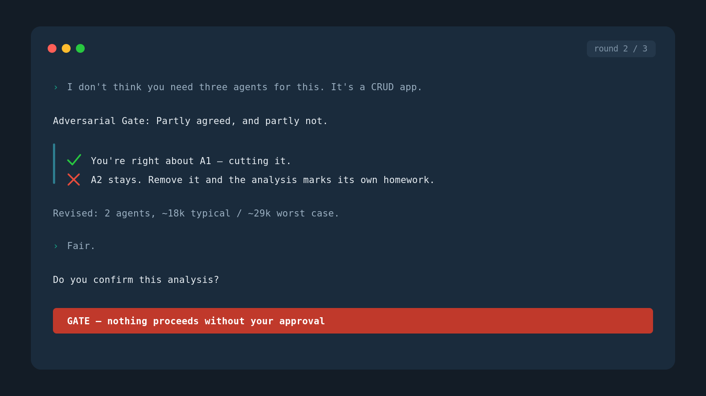

# Adversarial Gate



**A planning gate that runs before any agent is spawned.**
It designs the analysis, estimates the token cost, and forces a structured
adversarial review with you — capped at 3 rounds. Nothing executes without your
explicit approval.

> Most agent tooling optimises for *starting faster*.
> This one optimises for **not starting wrong**.

[](LICENSE)

---

## Why it's different

| | |
|---|---|
| 🛑 **Human-in-the-loop, not model-in-the-loop** | The adversarial review happens with **you**, capped at 3 rounds — not with another LLM marking its own homework |
| 💰 **Cost is a first-class citizen** | Every plan ships a typical/worst-case token estimate, explicitly labelled as an assumption, before anything runs |
| 📈 **Self-calibrating** | Estimated vs actual tokens are reconciled after every build and logged to [`CALIBRATION.md`](CALIBRATION.md) — the skill gets better at guessing over time, and admits it out loud when it isn't yet |
| 🖐️ **Handbrake on critical risk** | Security, irreversibility, minors'/sensitive data, budget, legal exposure — these stop the flow outright instead of waiting their turn in the round cap |
| 🕵️ **Contests itself, in isolation** | Above trivial complexity, self-critique runs as an isolated adversary subagent — not the same context defending the plan it just wrote |
| 🧩 **Proportional, not performative** | Trivial request → 1 agent, out of the way. Product-code request → a justified 5-role preset, trimmed by argument, never assumed |
| 🏗️ **Agent architecture is designed, not templated** | Every agent gets an ID, a role, an objective and a model tier, decided from scratch per request — never a fixed roster copy-pasted across plans |
| 🔀 **Two ways out, both engine-aware** | **PATH A** hands off a structured brief to a spec-driven PRD tool; **PATH B** builds directly, choosing between subagents / agent teams / dynamic workflows — the engine is picked twice, once for the analysis, once for the build, and justified both times |
| 🤝 **Hands off instead of competing** | Writes no PRD of its own — produces a handoff brief carrying the one artefact nobody else keeps: the record of the review |

## The problem

Agentic coding tools are extremely good at beginning work. You describe a goal,
and within seconds a fleet of subagents is running, burning tokens against an
interpretation of your request that nobody ever checked.

The failure mode is rarely bad execution. It is **excellent execution of the
wrong plan** — and you only find out after paying for it.

## What this does


See it in a full session below. Full flow, loop caps and where this sits in the ecosystem:
[`docs/architecture.md`](docs/architecture.md).

Three properties, in order of how much they matter:

1. **Adversarial review with the human.** The plan must survive your objections
   before a single token is spent on it. The skill is also required to surface
   its own weakest assumption each round — the ones an analyst doesn't notice
   are the ones that sink the work.
2. **Cost made discussable.** Every plan arrives with a typical/worst-case token
   estimate, explicitly labelled as an assumption. Over budget? It proposes a
   reduced version before asking for approval.
3. **Estimate reconciliation, written to a calibration ledger.** After a build,
   it reports estimated vs actual tokens and the cause of the gap, then appends
   the run to [`CALIBRATION.md`](CALIBRATION.md) — and **reads that file before
   the next estimate**. Below three runs on an engine it tells you outright that
   its numbers are uncalibrated. Estimates you never check are theatre; a ledger
   you never read back is just a diary.

## Install

```bash
git clone https://github.com/Lean-AI-ITA/adversarial-gate.git
mkdir -p ~/.claude/skills
cp -r adversarial-gate ~/.claude/skills/
```

Then simply describe a goal. The skill activates when you state an objective
large enough that the obvious move would be to start producing immediately.

## See it work

A full annotated session — including the moment the gate refuses to proceed and
the user's objection changes the architecture — is in
[`examples/session-transcript.md`](examples/session-transcript.md).

## What this is *not*

This is a deliberately small piece. It is **complementary**, not competitive:

| You want | Use |
|---|---|
| A full spec-driven development lifecycle | GitHub Spec Kit |
| PRD → task graph decomposition and tracking | Task Master |
| Production runtime, budgets, approval workflows at infra level | Shannon |
| Adversarial review of code that's already written | adversarial-review skills (Dzazaleo, lemon03390, others — see `REFERENCES.md`) |
| **A cheap, conversational gate that makes you justify the plan and the spend before any of the above start** | **this** |

It does not write its own requirements document. Path A produces a compact
handoff brief and points you at the tools above — with one thing they don't
produce: **the record of the contradictory review**, i.e. which objections were
raised and how they were resolved.

See [`REFERENCES.md`](REFERENCES.md) for the landscape and for links to the
official engine documentation (which this skill deliberately does not duplicate).

## Is this for you?

Honest self-assessment, not a pitch:

- **You'll like it if** an agent has ever executed a plan flawlessly and you
  still got the wrong thing — and you'd rather spend 90 seconds justifying a
  plan than an afternoon undoing one.
- **You won't like it if** you want agents to just go, and any pause reads as
  friction rather than insurance. That's a legitimate preference, not a bug
  report — this gate is built to get out of the way on trivial requests (see
  *Proportional* below), but it will never fully disappear on non-trivial ones.
  It's friction sold on purpose, to people who've already paid for the
  alternative once.
- **It assumes** you're already orchestrating subagents, agent teams or
  dynamic workflows in Claude Code. If you're not there yet, the token
  estimate and calibration ledger won't mean much — install it when that
  becomes true, not before.
- **Especially relevant if you run local or self-hosted models.** Token cost
  there isn't an abstract line on a bill — it's your own GPU, your own
  electricity, your own twenty minutes watching inference run on the wrong
  architecture. The cost-before-execution discipline hits harder when the
  alternative is felt directly on your own hardware. One caveat, honestly
  stated: §1.5's engine choice (subagents / agent teams / dynamic workflows)
  is Claude Code vocabulary — mapping it onto a local orchestrator is an
  adaptation, not a drop-in.

## Design notes

- **Proportional.** If a request is trivial, the gate says so and gets out of
  the way. A gate that fires on everything is a tax, not a control.
- **Engine-agnostic.** It chooses between subagents / agent teams / dynamic
  workflows twice, for different purposes: once to *analyse*, once to *build*.
  Analysis is almost always light; the engines only really differ on the build.
- **Epistemically labelled.** Every claim is marked Evidence / Inference /
  Assumption / Uncertainty. Estimates are never dressed up as measurements.
- **No unbounded loops.** Every loop carries a soft stop condition *and* a hard
  cap, and declares a partial state on cap.
- **Handbrake, not a round.** An objection touching security, irreversibility,
  minors'/sensitive data, budget or legal exposure stops the flow outright —
  it does not wait its turn in the 3-round cap.
- **The critique doesn't mark its own homework either.** Past trivial
  complexity, the self-critique in the review runs as an isolated adversary
  subagent, not as the same context that designed the plan talking to itself.
- **A preset, not a constant.** For user-facing product code, the default
  starting slate is five roles — UX/product design, refactoring & performance,
  security, product/user-needs liaison, and a scout for reusable prior art —
  each cut or kept by argument in the review, never assumed.

## Contributing

Objections welcome — it would be somewhat ironic otherwise. Particularly
interested in: calibration data from real
reconciliation tables, and cases where the gate fired when it shouldn't have.

## License

MIT — see [LICENSE](LICENSE).
