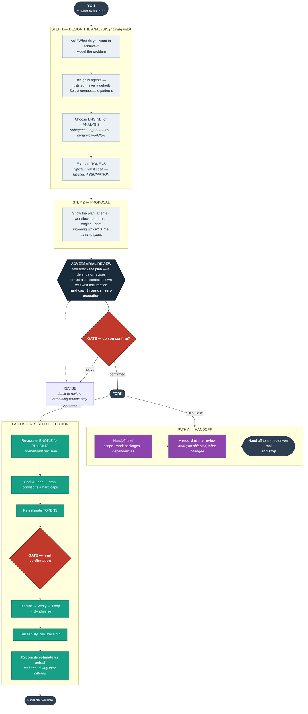
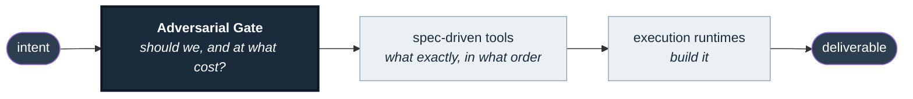

# Architecture

The whole point of this skill is the shape of the diagram below: **three gates
in a row, and nothing crosses one without you.**

## Full flow

## Reading the diagram

**Three red gates and one dark box.** The dark box is the adversarial review;
the red shapes are the points where the system stops and waits for you. Every
other node is work that happens *between* gates. If you remember one thing:
**no node crosses a gate on its own initiative.**

**The engine is chosen twice, and they are independent decisions.** Once to
analyse (STEP 1), once to build (PATH B). Analysis is almost always light work,
so it defaults to subagents; the three engines only really differ under the
weight of construction. Choosing the build engine in STEP 1 is the most common
way to over-engineer a plan.

**PATH A ends in a stop, not a deliverable.** It hands off. The one thing it
carries forward that no spec-driven tool produces is the *record of the review* —
the audit trail of why the plan looks the way it does.

**PATH B ends in a reconciliation, not an artefact.** The estimate from STEP 1
gets checked against reality and the gap gets explained. An estimate that is
never reconciled is theatre.

## The loop discipline

Two loops exist in this system and both are capped, for the same reason:

| Loop | Soft stop | Hard cap | On cap |
|---|---|---|---|
| Adversarial review | plan is agreed | **3 rounds** | consolidate best version, go to gate |
| Execution loop (Path B) | checklist satisfied / no new useful work | `max_iterations`, `max_agents`, `max_token_budget` | stop, declare partial state, list what's missing |

An uncapped review is an argument. An uncapped execution loop is a bill.

## Where this sits

This skill occupies the leftmost box only, deliberately. See
[`../REFERENCES.md`](../REFERENCES.md) for what to use downstream.
